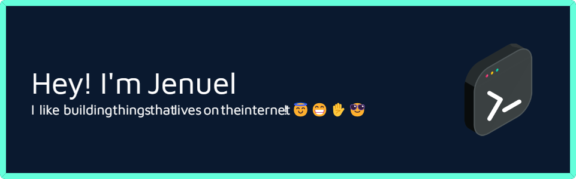

###  👔 About Me

In 2016, I made a strategic shift from my studies in criminology to pursue a career in Information Technology, where I discovered the intricate and captivating field of software development.

Fast-forward to today, with over 5 years of professional experience as a software developer, I have consistently engaged in the dynamic and ever-evolving landscape of software development, collaborating with fellow coding enthusiasts and contributing to some truly remarkable products.

I take pride in my attention to details, meticulously examining even the smallest elements that could potentially snowball into significant issues. Whether it's ensuring code efficiency or perfecting a recipe, I believe that thoroughness in the details is essential for overall success for building scalable, engaging, & accessible digital experience.

When I’m not at the computer, I’m usually playing a guitar even though I'm not a pro in it, trying to read books, walking outside, having a home work out, eating a meal or playing a PUBG Mobile with friends.

-   🗺 Im from Benguet, Luzon, Philippines!
-   I know how to 🏊‍♀️🏊‍♂️ `swim`, 🎸 play `guitar` (a little bit), i also play 💻 `games`.
-   🙏 👆 I believe in a Creator, as I also am a creator of apps.

### 🛠 Languages And Tools

### 🔗 Connect With Me

### 🚨 Latest Blog posts

<!-- BLOG-POST-LIST:START -->
- [JavaScript: Ways To Manipulate String](https://brojenuel.com/blog/JavaScript-Ways-To-Manipulate-String)
- [Why VueJS will be the future?](https://brojenuel.com/blog/Why-VueJS-will-be-the-future-)
- [Top 3 Best Freelance Websites](https://brojenuel.com/blog/Top-3-Best-Freelance-Websites)
- [Why &quot;CANVA&quot; is essential for most businesses?](https://brojenuel.com/blog/Why-CANVA-is-essential-for-most-businesses-)
- [Ways To Manipulate Objects In JavaScript](https://brojenuel.com/blog/Ways-To-Manipulate-Objects-In-JavaScript)
<!-- BLOG-POST-LIST:END -->

### Personal Works

-   [Believers Sword](https://believers-sword.brojenuel.com/)
-   [FamTree](https://fam-tree.brojenuel.com/)
-   [Others](https://brojenuel.com/my-work)

### Buy Me A Coffee 😁

